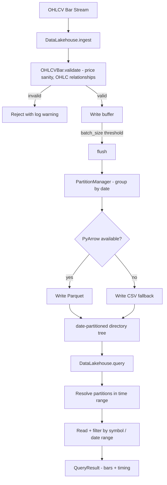

# market-data-lakehouse

> OHLCV market data ingestion pipeline with date-partitioned Parquet storage

[](https://github.com/jrajath94/market-data-lakehouse/actions)
[](https://codecov.io/gh/jrajath94/market-data-lakehouse)
[](https://opensource.org/licenses/MIT)
[](https://www.python.org/downloads/)

## Why This Exists

Market data feeds produce millions of events per day per instrument. Standard event storage (flat CSV files) adds query latency and operational complexity. This ingestion pipeline writes OHLCV bars to date-partitioned Parquet files, with a CSV fallback for environments without PyArrow.

## Architecture


```mermaid
graph TD
    A[OHLCV Bar Stream] --> B[DataLakehouse.ingest]
    B --> C[OHLCVBar.validate - price sanity, OHLC relationships]
    C -->|invalid| D[Reject with log warning]
    C -->|valid| E[Write buffer]
    E -->|batch_size threshold| F[flush]
    F --> G[PartitionManager - group by date]
    G --> H{PyArrow available?}
    H -->|yes| I[Write Parquet]
    H -->|no| J[Write CSV fallback]
    I --> K[date-partitioned directory tree]
    J --> K
    K --> L[DataLakehouse.query]
    L --> M[Resolve partitions in time range]
    M --> N[Read + filter by symbol / date range]
    N --> O[QueryResult - bars + timing]
```

The pipeline has three stages. The **ingest layer** validates each bar (high >= low, open/close within range, non-negative volume) and buffers up to `batch_size` records before an auto-flush. The **storage layer** writes Parquet files partitioned by date: `base_path/YYYY-MM-DD/data_<ts>.parquet`. The **query layer** resolves which partitions overlap the requested time range, reads only those files, and applies symbol and timestamp filters — skipping all other data on disk.

## Quick Start

```bash
git clone https://github.com/jrajath94/market-data-lakehouse.git
cd market-data-lakehouse
make install && make test
```

```python
from datetime import datetime
from market_data_lakehouse import DataLakehouse, OHLCVBar, AssetClass

lake = DataLakehouse(path="./market-data/", batch_size=1000)

lake.ingest(OHLCVBar(
    symbol="AAPL",
    timestamp=datetime(2024, 1, 15, 9, 30),
    open=185.00, high=186.50, low=184.75, close=186.10,
    volume=1_500_000,
    asset_class=AssetClass.EQUITY,
))
lake.flush()

result = lake.query(
    symbol="AAPL",
    start=datetime(2024, 1, 15),
    end=datetime(2024, 1, 15, 23, 59),
)
print(f"Bars: {result.count}, scanned in {result.query_time_ms:.1f}ms")
```

## Key Design Decisions

| Decision | Rationale | Alternative Considered | Tradeoff |
|----------|-----------|----------------------|----------|
| Parquet columnar storage | All prices for a symbol are stored together; columnar layout enables compression | CSV (human-readable, no dependency) | Binary format requires tooling; PyArrow optional, with CSV fallback for environments without it |
| Date-based partitioning | Most market data queries are time-bounded (`WHERE date = '2024-01-15'`); partition pruning eliminates scanning irrelevant files | Partition by symbol (creates too many small files at 8k+ symbols) | Single-stock queries read one partition; cross-day aggregations scan multiple partitions |
| Batched writes with auto-flush | Amortizes write overhead across multiple bars; reduces per-write syscall overhead | Synchronous per-bar writes (simpler) | Small write latency (buffered until batch fills) but much higher sustained throughput |
| PyArrow with CSV fallback | Graceful degradation — the core pipeline works even without PyArrow installed | Require PyArrow (simpler code) | Slightly more complex read/write dispatch but usable in constrained environments |
| Frozen `OHLCVBar` validation method | Validates OHLC relationships at the data model level, not the storage level | Validate at ingest time only | Bar integrity is enforced regardless of how the bar was constructed |

## Testing

```bash
make test    # Unit + integration tests
make clean   # Clean up cache files
```

## License

MIT — Rajath John
